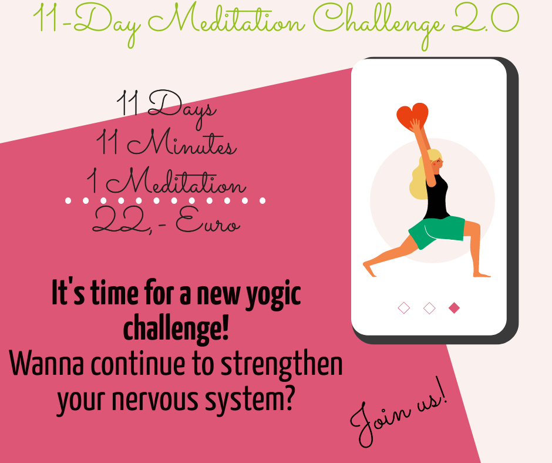

Meditating has been with me for a couple of years now and over time I have become more and more immersed in this fascinating subject. You can meditate in many different ways - including the Kundalini Yoga way. 😉 
But first let's have a look at what exactly it means to meditate.

### Meaning of meditation

First of all, meditating is a process that enables you to control and eventually overcome your thought waves. Every second your mind produces new thoughts, so you find yourself in a sea of them. By consciously meditating, you can order this sea and bring it to rest. This allows your soul to shine. It can then shape its path, its destiny, in a more focused way. 

### Effects of meditating

What else does the act of meditating bring? There is a long list of positive effects on your system. I will present you the most important effects here.

- Development of your neutral mind. This is also called the meditative mind. It is important to make decisions in your life as neutral as possible - without positive or negative influences - and aligned with the purpose of your soul.

- Increased well-being, inner peace, stability and tranquility. By controlling your multiple thoughts, you inevitably attain a more peaceful state and radiate more and more tranquility to the outside world.

- Developing your intuition. Your intuition has an enormously important power, as it guides you to where your soul wants to go. Unfortunately, many people lose the connection to their own intuition and act increasingly from the mind. A reconnection to as well as expansion of your intuition will come about through regular meditation.

- Promote mental clarity, mental awareness and existence in the present. Through meditation you will learn to overcome your thoughts. That is, you no longer allow yourself to be so strongly guided by your random thoughts, but take the helm yourself, so to speak. You act more and more consciously and clearly and can thereby perceive yourself and your environment in the here and now. 

- Development of the frontal lobe of the anterior brain. Here, among other things, the seat of your personality is located, as well as a great connection to your executive functions. Abilities in this area are therefore promoted.

- Positive influence on blood pressure, cholesterol level and immune system. 
The resulting relaxation probably allows narrowed blood vessels to dilate again, so that your blood pressure is lowered. In addition, stress increases your susceptibility to disease because your immune system is weaker. Meditation reduces your perception of stress, which improves the performance of your immune system. Since stress also causes high cholesterol, the process of meditation lowers it as well as blood pressure.

- Clearing the mind. By directing your thoughts and letting them pass you by more instead of taking them in, you keep your subconscious mind cleaner. These passing thoughts can't even penetrate your system deeply enough to seek out your subconscious mind. By doing this, you purify your mind. 

So you see, the activity of meditating - especially regularly - brings many beneficial effects. I can only say: It is worth it! 

### Types of meditation in Kundalini Yoga

You can meditate in many different ways, which is what Kundalini Yoga likes to do. There are two basic distinctions to make: meditating with or without a mantra. The selection of possible mantras in Kundalini Yoga is relatively large, so you can certainly find a mantra that resonates with you and moves you forward, making your soul shine. 

Moreover, you can meditate not only while sitting, but also while walking or with a partner facing you (then sitting again). There are also meditations in which a deep gong is played. In my opinion, this really has something very magical. Also the so-called "celestial comunication", i.e. the connection of mantra and movement, is a form of meditation in Kundalini Yoga. 

### 11-day meditation challenge

At the end of last year, I offered a meditation challenge online. In this challenge we did the same meditation (from Kundalini Yoga) together for 11 days, namely the "Meditation to see the unseen". This meditation does not use a mantra, but special arm and hand postures. The left arm is positioned next to the torso and the left hand is brought into Surya Mudra (thumb and ring finger connected). The right arm is extended straight forward with the palm facing upward forming a small bowl. You close your eyes in this position and then focus on your moon center, which is your chin. 
You can see a picture of the position at the beginning of this post and the video of it right here. 👇

<iframe width="700" height="350" src="https://www.youtube.com/embed/wM7-2UzCAjw" frameborder="0" allow="accelerometer; autoplay; clipboard-write; encrypted-media; gyroscope; picture-in-picture" allowfullscreen></iframe>

The most exciting thing is your own development over these 11 days in using meditation. You can feel through repeated practice exactly what the meditation is doing to you, where it is working, how you are taking on the challenge each day and eventually mastering it. After 11 days, you will definitely come out powerful if you have been able to engage in the process of meditating. It's all worth a try!

This meditation challenge really bonded us all together and almost all participants were live every day. So we felt more supported by the group and accepted this challenge together, even if in the end of course everyone was allowed to master the task for themselves. 
After 11 days all participants were satisfied and proud of themselves, but at the same time a little sad that the time of meditating together was now over. Of course, everyone can continue to practice with the video I provided, but it is something else to come together live and meditate. 

So I have decided to offer a new 11-day meditation challenge to open the space for this again. This time we will practice a different meditation, which again lasts 11 minutes. This one also works on your nervous system and strengthens it. In addition, this meditation is said to have a rejuvenating effect. So then, let's go, or what are you still thinking about? 😉

To join the upcoming meditation, you can simply send me an [email](mailto:ruhahealing@gmail.com?subject=Join%20the%20meditation%20challenge)
, then you will receive all the necessary details and after receipt of payment also the access link. I am really looking forward to meet you and to start this meditation journey together with you. 

Sat Nam! 