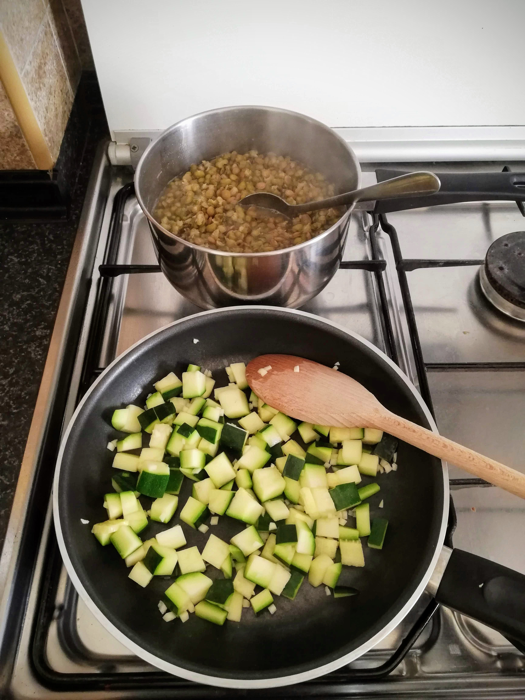

And this is what my first day looked like... 

## Day 1

 

I usually eat a lot of fresh fruit in the morning, but I generally mix it with yoghurt or porridge. But today, my first breakfast allows me only a **pure green fruit bowl** as you can see in the top of this post. These fruits did not really keep me full for a long time, so that I soon start to think about lunch. I bought some **spinach**, because I was very much in the mood for it. I add **zucchini** and a mini onion as well as some garlic (yes, these ingredients are allowed despite the missing green colour - what a blessing! 🙏🏽 ). Everything was cooked together and what can I say, it is really delicious. However, I forgot how much the leaves still lose volume during cooking. So the lunch portion was quite small for the size of my hunger.

Well then, since there is no limit to the number of meals - luckily 😀 -, I started cooking again in the afternoon. I had previously soaked the **mung beans** for a few hours and then boiled them up. I also add a good amount of **green lentils**. I think lentils are just delicious and suitable for mung beans - from my point of view only recommendable. You can also add the lentils to the mung beans for the last 15 minutes if you want to eat them together anyway. Just make sure that you have enough water in your pot - mung beans and lentils need to have enough water to get ready. Additionally, I add **zucchini fried with some onion and garlic**. That is also a very tasty menu.

In the evening I do some **Kundalini Yoga**, which is very good for me at this moment. I can immerse myself in the Kriya and relax. My body feels fulfilled and comfortable afterwards and I am deeply grateful. 

But… maybe you can guess… I was hungry again that evening. Oh gosh, should I cook again? A view into the pantry makes my eyes stop at the **Pimientos de Padron**. So I fry some of them thoroughly. This is really tasty. I also eat a few **green olives**. Finally I feel filled up again. 

Later in the evening I go to bed with a little hunger, but also with a **light and happy** feeling. The food during the day did me very well, I already noticed that this evening.

# Day 2

The morning begins as usual and I prepare my green fruit breakfast. It is the same as yesterday, a big bowl full of delicious fresh fruit. Yammi! 🍏🍐🥝🍈

However, for today it is also clear that I have to buy more green food.Most of it is already consumed, so I plan to visit the local organic farm in the neighboring village in the afternoon. I also decided to go to the market and buy some green stuff for today's lunch. No sooner said than done. The market supplies me with leek, broccoli, green asparagus, savoy cabbage and cucumber. I also use some of these for my lunch menu. This is mung beans with green lentils, broccoli, leek and savoy cabbage. 

In the afternoon I visit the mentioned local organic farm here in Portugal. It is really beautifully situated in the hinterland, surrounded by a lot of green and fertile soil. With a friend who knows the owner of the farm, I cycle there together.I pick out some of the delicacies of this week's harvest. I pick out some of the delicacies of this week's harvest.  Take a look: 

In the big glass there are green olives and in the small homemade ghee. Yes, this is also allowed as a small ingredient in the dishes. 

Afterwards I am looking forward to cooking with all these fresh ingredients. For tonight's dinner I prepare a delicious salad, as you can see on the next picture. As ingredients from the farm, you can find salad, raw zucchini and some of the fresh rosemary. I also add iceberg lettuce, which I had left over, as well as cucumber and dried garden herbs. 

In addition I eat some of the olives. I mix them with the herbs I got separately and that is a really delicious combination.  I ate it all outside in the evening sun. The day ends really nice and I feel very well. 