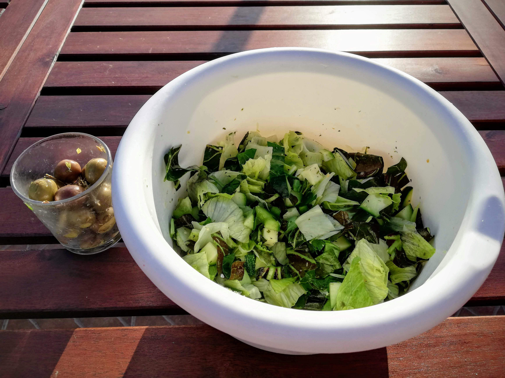

## Day 1

 

I usually eat a lot of fresh fruit in the morning, but I generally mix it with yoghurt or porridge. But today, my first breakfast allowed me only a **pure green fruit bowl**. These fruits did not really keep me full for a long time, so that I soon started to think about lunch. I bought some **spinach**, because I was very much in the mood for it. I added **zucchini** and a mini onion as well as some garlic (yes, these ingredients are allowed despite the missing green colour - what a blessing! 🙏🏽 ). Everything was cooked together and what can I say, it was really delicious. However, I forgot how much the leaves still lose volume during cooking. Thus the lunch portion was quite small for my big hunger.

Well then, since there is no limit to the number of meals - luckily 😀 -, I started cooking again in the afternoon. I had previously soaked the **mung beans** for a few hours and then boiled them up. I also added a good amount of **green lentils**. I think lentils are just delicious and suitable for mung beans - from my point of view only recommendable. You can also add the lentils to the mung beans for the last 15 minutes if you want to eat them together anyway. Just make sure that you have enough water in your pot - mung beans and lentils need to have enough water to get ready. I also added **zucchini, which were fried with some onion and garlic**. That is another very tasty menu.

In the evening I did some **Kundalini Yoga**, which felt very good for me at this moment. I could immerse myself in the Kriya and relax. My body felt fulfilled and comfortable afterwards and I was deeply grateful. 

But… maybe you can guess… I was hungry again that evening. Oh gosh, should I cook again? A view into the pantry makes my eyes stop at the **Pimientos de Padron**. So I fried some of them thoroughly. This was really tasty. I also ate a few **green olives**. Finally I felt filled up again. 

Later in the evening I went to bed with a little hunger, but also with a **light and happy** feeling. The food during the day did me very well, I already noticed that this evening.

## Day 2

The morning began as usual and I prepared my **green fruit breakfast**. It was the same as yesterday, a big bowl full of delicious fresh fruit. Yammi! 🍏🍐🥝🍈

However, for today it was also clear that I had to buy more green food. Most of it was already consumed, so I planed to visit the **local organic farm** in the neighboring village in the afternoon. I also decided to go to the **food market** and buy some green stuff for today's lunch. No sooner said than done. The market supplied me with leek, broccoli, green asparagus, savoy cabbage and cucumber. I also used some of these for my lunch menu. This was **mung beans with green lentils, broccoli, leek and savoy cabbage**. 

In the afternoon I visited the mentioned local organic farm in Portugal. This is really beautifully situated in the hinterland, surrounded by a lot of green and fertile soil. With a friend who knows the owner of the farm, we cycled there together. I picked out some of the **delicacies of this week's harvest**. Take a look! 👇🏽

In the big glass there are **green olives** from this region and in the smaller **homemade ghee**. Yes, this is also allowed as a small side addition in the dishes. 

Afterwards I was already looking forward to cook with all these fresh ingredients. For tonight's dinner I prepared a **delicious salad**, as you can see on the next picture. As ingredients from the farm, you can find salad, raw zucchini and some of the fresh rosemary. I also added iceberg lettuce, which I had left over, as well as cucumber and dried garden herbs. 

In addition I ate some of the **olives**. I mixed them with the herbs I got separately and that was a really delicious combination. I ate it all outside in the evening sun. The day ended really nice and I felt very well. 

All in all I can say about these first two days that I definitely **enjoyed them a lot**. It is of course a change for the body, I felt that. Nevertheless, I also noticed that the green diet was good for me. I felt pleasantly satiated and even though I ate more food than usual, I felt lighter inside than usual. I was very **curious how the next days would work out**. 
If you are also curious, feel free to follow me on this blog or social media, where I always share all the latest news with you. 🤩

***Important note:**
On my blog you can find tips and insights on the topics nutrition, health, body, mind and soul. These information are primarily based on my own experiences with it, so they can in no way replace a visit to the doctor. Please read my [**Disclaimer**](https://ruhahealing.com/legal/) and consult your doctor if you have unclear symptoms.*