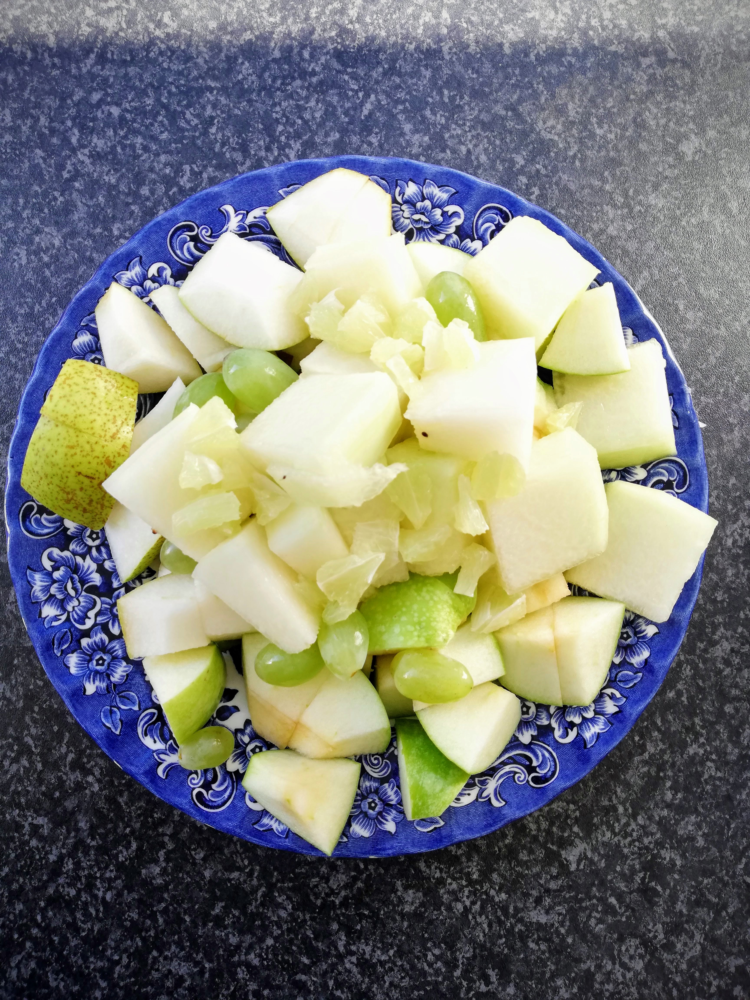

# Day 2

The morning begins as usual and I prepare my green fruit breakfast. It is the same as yesterday, a big bowl full of delicious fresh fruit. Yammi! 🍏🍐🥝🍈

However, for today it is also clear that I have to buy more green food.Most of it is already consumed, so I plan to visit the local organic farm in the neighboring village in the afternoon. I also decided to go to the market and buy some green stuff for today's lunch. No sooner said than done. The market supplies me with leek, broccoli, green asparagus, savoy cabbage and cucumber. I also use some of these for my lunch menu. This is mung beans with green lentils, broccoli, leek and savoy cabbage. 

In the afternoon I visit the mentioned local organic farm here in Portugal. It is really beautifully situated in the hinterland, surrounded by a lot of green and fertile soil. With a friend who knows the owner of the farm, I cycle there together.I pick out some of the delicacies of this week's harvest. I pick out some of the delicacies of this week's harvest.  Take a look: 

In the big glass there are green olives and in the small homemade ghee. Yes, this is also allowed as a small ingredient in the dishes. 

Afterwards I am looking forward to cooking with all these fresh ingredients. For tonight's dinner I prepare a delicious salad, as you can see on the next picture. As ingredients from the farm, you can find salad, raw zucchini and some of the fresh rosemary. I also add iceberg lettuce, which I had left over, as well as cucumber and dried garden herbs. 

In addition I eat some of the olives. I mix them with the herbs I got separately and that is a really delicious combination.  I ate it all outside in the evening sun. The day ends really nice and I feel very well. 

# Day 3

This morning I feel the hunger coming back in me as soon as I wake up. Thoughts of breakfast are already on my mind. I notice that I am very much in the mood for my "old" breakfast, although it is really similar to that - well, without any carbohydrates. However, when I'm about to eat the fresh fruit, I'm happy and full again. And today I added some lemon on top. That gave my breakfast a special sour tase I really enjoyed. 

For early lunch I have mung beans with green lentils, served with savoy cabbage, leek and broccoli. I think these mung beans are really tasty these days, maybe also because they make me a little bit more filling in comparison!  In any case, this is a personal discovery of a food that I would like to use more regularly in cooking from now on. I've never used it to prepare anything myself, I've only eaten mung beans with others. Try it out! 🙃

Apart from that, I can say on this day 3 that I still feel very well, despite the regular hunger.But that is understandable without all the carbohydrates that are usually integrated in my meals. 

For an early dinner today I make myself a green smoothie. I can warmly recommend that as well! I had a mixture of a special kind of cress, an apple, a kiwi, half a banana WITH peel - yes that's allowed 😉 - and half a lime in addition. 

 💚

This smoothie is really tasty, but a bit too bitter for me. Next time I'll use some more sweet fruits.

You may have noticed that I always leave the skin on the kiwi. I've been doing it for years. For me it tastes even more intense with the skin on and remains a very tasty fruit in my opinion. This also applies to the less popular, hairy kiwis ;) Many of the nutrients are in or directly under the shell and by removing them your body will not even be able to enjoy these valuable ingredients. Consider this as an invitation to try one or the other fruit WITH the shell and do your body even more favours. 