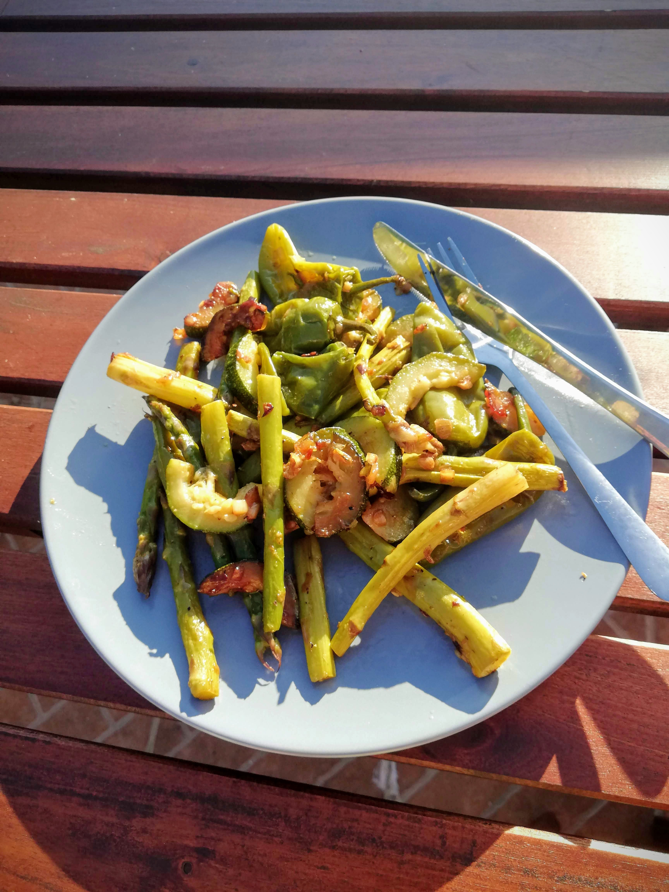

# Day 3

This morning I feel the hunger coming back in me as soon as I wake up. Thoughts of breakfast are already on my mind. I notice that I am very much in the mood for my "old" breakfast, although it is really similar to that - well, without any carbohydrates. However, when I'm about to eat the fresh fruit, I'm happy and full again. And today I added some lemon on top. That gave my breakfast a special sour tase I really enjoyed. 

For early lunch I have mung beans with green lentils, served with savoy cabbage, leek and broccoli. I think these mung beans are really tasty these days, maybe also because they make me a little bit more filling in comparison!  In any case, this is a personal discovery of a food that I would like to use more regularly in cooking from now on. I've never used it to prepare anything myself, I've only eaten mung beans with others. Try it out! 🙃

Apart from that, I can say on this day 3 that I still feel very well, despite the regular hunger.But that is understandable without all the carbohydrates that are usually integrated in my meals. 

For an early dinner today I make myself a green smoothie. I can warmly recommend that as well! I had a mixture of a special kind of cress, an apple, a kiwi, half a banana WITH peel - yes that's allowed 😉 - and half a lime in addition. 

 💚

This smoothie is really tasty, but a bit too bitter for me. Next time I'll use some more sweet fruits.

You may have noticed that I always leave the skin on the kiwi. I've been doing it for years. For me it tastes even more intense with the skin on and remains a very tasty fruit in my opinion. This also applies to the less popular, hairy kiwis ;) Many of the nutrients are in or directly under the shell and by removing them your body will not even be able to enjoy these valuable ingredients. Consider this as an invitation to try one or the other fruit WITH the shell and do your body even more favours. 

# Day 4

Today is the "mountain festival" - half of the green diet week is already mastered, so to speak, at least around noon. 

For breakfast, I guess I don't need to say much anymore: There was the same fresh fruit as the last days. Also today I found this again a delicious and good mixture.

In fact, today I was not as hungry as the days before. It is often said that the body has to get used to this change during the first 1-3 days. So maybe I had truly arrived at all levels since today... 
What I have noticed from time to time, however, are certain movements in the stomach area that seem new to me. It feels a bit like internal cramps, but it is not really painful. I suspect detoxification processes in my body... and with this thought I can accept the feeling well and let my body do its work.

Then at lunch I just warmed up the leftovers from yesterday. It was the mung beans with lentils, broccoli, leeks and savoy cabbage. Even today this set still tasted wonderful. But that could also be because I took this food with me on our bike trip and then enjoyed it on the picnic blanket on the beach. This way everything tastes even better. 

In the evening I took the cooking spoon again and celebrated my mountain festival with fresh green asparagus, the remaining Pimientos de Padron and some zucchini. Everything was first steamed and at the end fried a little bit - delicious! 
Ready cooked I enjoyed the food outside in the evening sun. 

