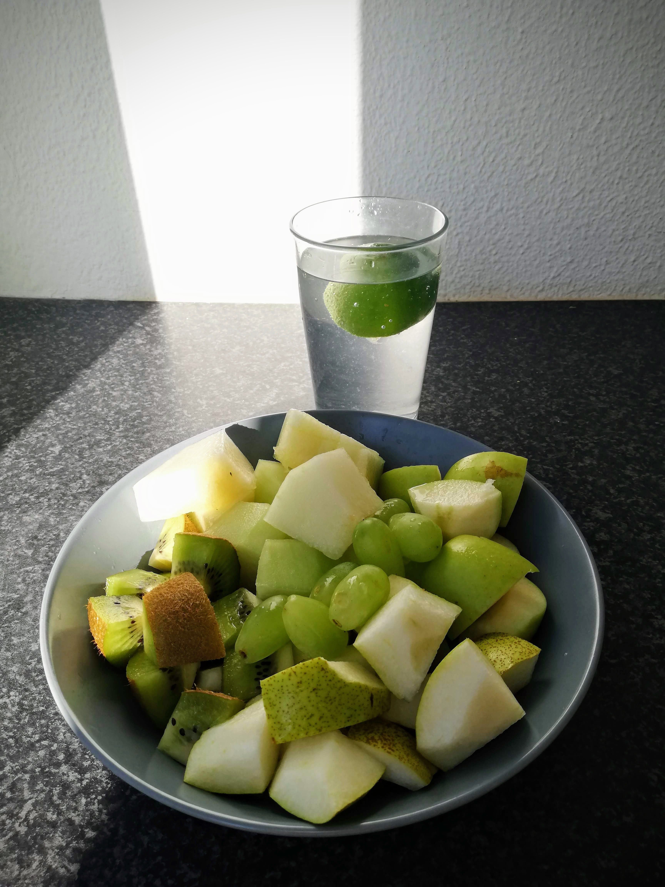
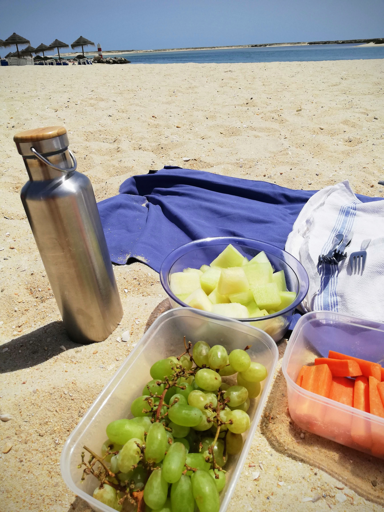
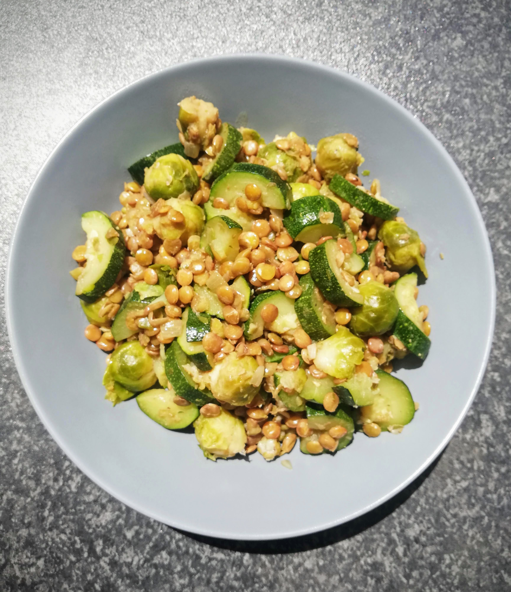
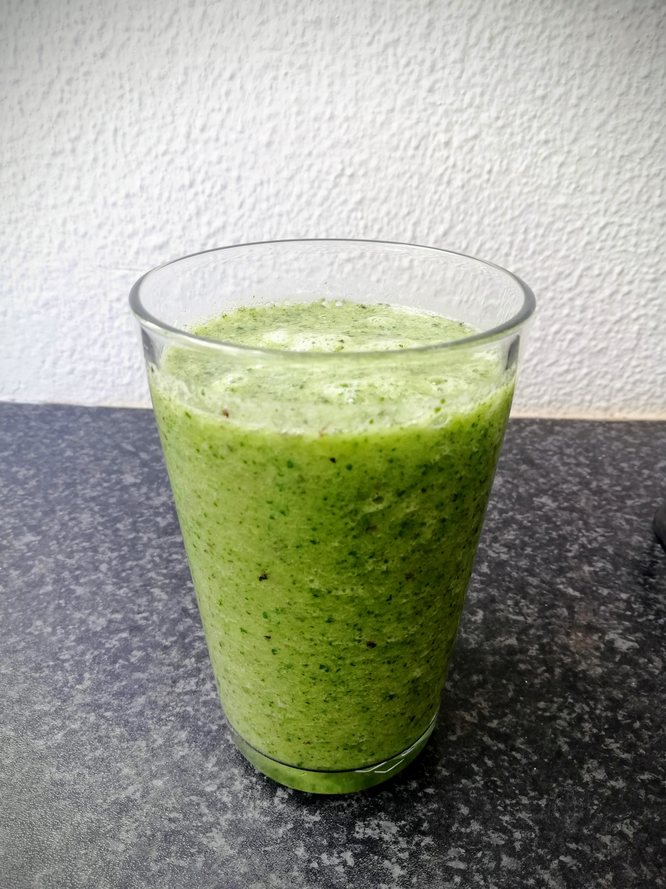

# Day 5

This morning I started with my **little yoga set** like every day and noticed already before that I sart this day with an unstable circulation. I know this from myself, so I took it easy and went peacefully to my yoga mat. Once there, I started with my **Kundalini Yoga** morning exercises, whereby I already noticed that I became quite warm, or rather hot. I then changed to short, airy clothes and continued with yoga, but left out some positions that require more power. I was sweating more and more, but not sweating due to the effort, but rather out of nowhere. I also had the feeling that I **urgently needed food and water**. So I first drank half a liter of water and started to prepare my breakfast and cut fruit. It is still the same as the days before. 😉 Afterwards I felt much better again and I think that this what happend to me in the morning was kind of a **detoxification process**. Wow - that was definitely very intense!

After that I had enough energy to participate in my Sunday morning yoga class. I also felt very well there and was able to gain a lot of strength and **prana, the so-called life energy**, from it. I felt deep gratitude and bliss within me. 🙏🏽

After the by now rather unspectacular, but always delicious breakfast, I made myself the really last **leftovers of the mung bean dish** for lunch. You already know this one from the past days. It was only a small remainder, but for now it satiated me sufficiently. 

Afterwards I cycled to the beach. Once there, the prepared snacks were taken out. For me these are grapes and melon. With sunshine and the sound of the sea these fresh snacks taste much better than they already do. ☀️ 🌊 

Back again from the bike trip I looked deeper into the fridge at home. There I actually found another mini leftover of the mung beans and ate it directly. Afterwards I ate some **green olives** and was satisfied again.

In the evening I offered my **online Kundalini Yoga session**. It was a lot of fun again and I felt really positively energized and very happy at the end of it. If you would like to participate in one of my online Kundalini Yoga classes, please register for it using the **link at the end of this post**. The course on every Sunday evening is so far **free of charge** and **open for all interested people**. I am looking forward to welcome you there! 🧘🏽‍♂️

# Day 6

After my breakfast, which you probably know by now, I did my work like every day. I still felt the **positive after-effects of yesterday's yoga session** and all the healthy green food. My body has probably never received so much **chlorophyll** in such a short time. 🙃 I noticed a real **energy boost** and was looking forward to the recurring fruit breakfast more than usual.

Nevertheless, I was very hungry again around noon. While I was cutting the vegetables, my stomach felt very unfamiliar. It was definitely not just the hunger and rather felt a little crampy in my stomach. I had the **feeling that my body was actively working and freeing me from toxins** and other things like that. Even if it was a bit unpleasant, I could accept it. After a few minutes this process was over again and I prepared the following lunch for myself later: **brussels sprouts, zucchini and green lentils with some onion and garlic** - all steamed together. I was really happy to finally cook brussels sprouts again, which I really love to eat. 

In the afternoon I started the **smoothie** production again. This time I used a little less of the cress as an ingredient, plus half a banana, a green apple, a kiwi and some of the green melon. This smoothie was definitely **sweeter** than last time and therefore even more delicious. I added a few ice cubes as refreshment and enjoyed the smoothie very much. 

I warmed up the leftovers from lunch again for the evening and sat down for dinner in the warming evening sun. This sixth day of the green diet was again very **beneficial and enriching for my body**.I felt **strengthened and satisfied**. The green diet is becoming easier and easier for me and I can very well imagine to follow this diet for a longer period next time. 💚

***Important note:**
On my blog you can find tips and insights on the topics nutrition, health, body, mind and soul. These information are primarily based on my own experiences with it, so they can in no way replace a visit to the doctor. Please read my [**Disclaimer**](https://ruhahealing.com/legal/) and consult your doctor if you have unclear symptoms.*