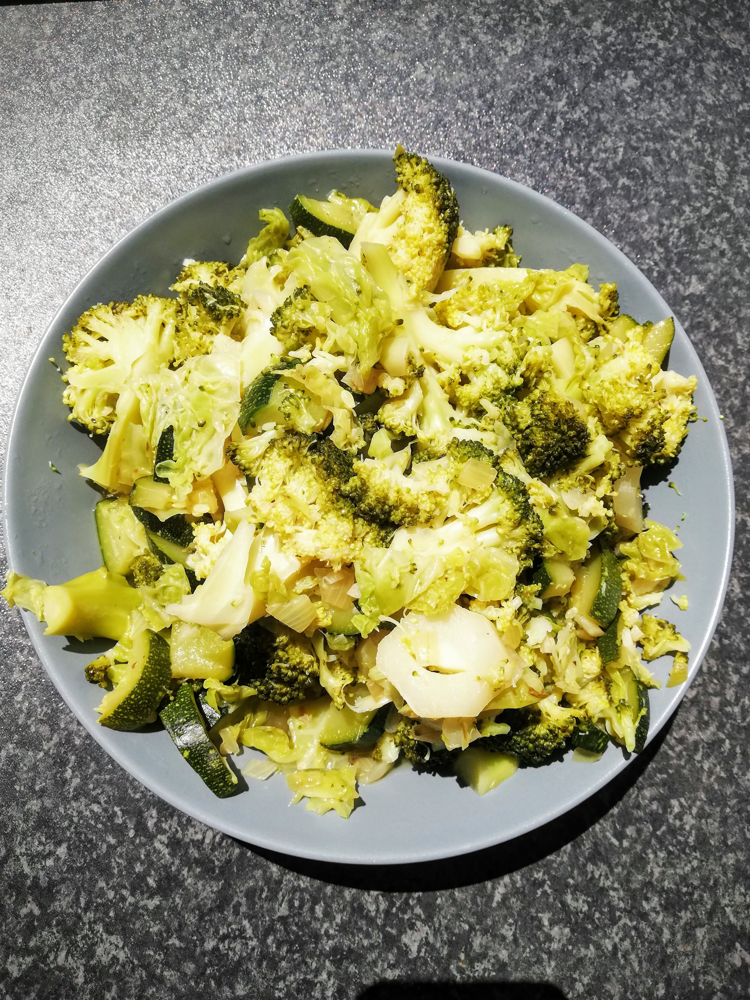
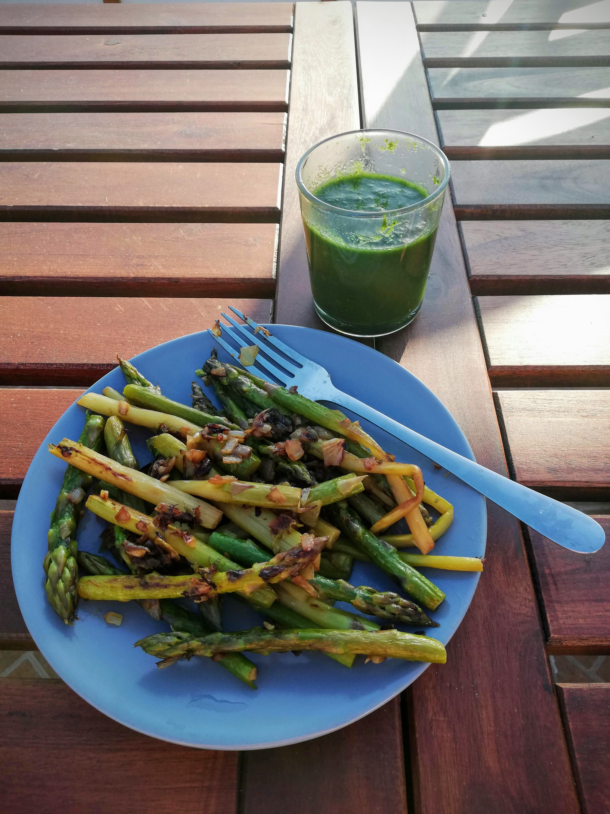
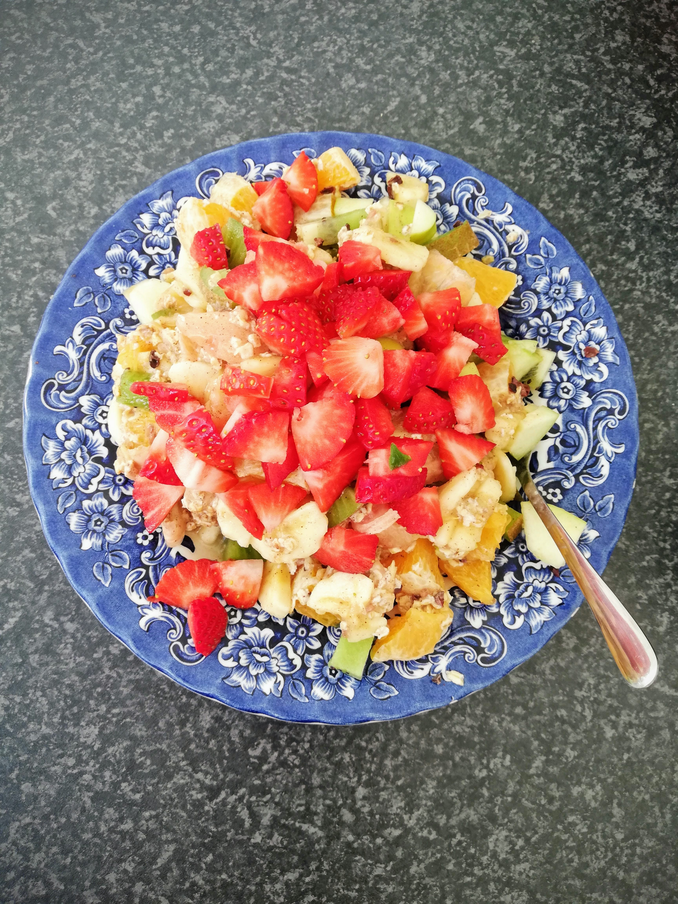

# Day 7

For breakfast today I had the same for the last time as the previous six days. I still liked this mixture of fresh fruits very much. Nevertheless I can say that I was looking forward to the growing variety in the coming days. 

After my work in the morning I started to cook again. For the last day this steamed vegetables were on the menu: **broccoli, zucchini and leek**. This was once again a very tasty combination and I ate a big portion of it. 

As expected, this lunch didn't keep me full for too long, so I prepared another **green smoothie** in the afternoon. This one was very tasty again and made of cress, half a banana, lemon, grapes, apple and rosemary. This preparation of smoothies in general is something that I would like to include more in my daily diet. They are quick to prepare, very healthy and can be customized. **Definitely a recommendation!** 👌🏽

 💚

For dinner I fried the last **green asparagus with onion and garlic**. I also had the rest of today's smoothie. All together the dinner was a really delicious meal. Peacefully I enjoyed everything in the evening sun and felt a lot of **happiness and well-being** inside me. With this feeling finally the seventh and for this time last day of my green diet passed. 

### A few final thoughts...

Wow, I was really amazed at how quickly these 7 days went by. From the first day after the green diet I returned to eating non-green food. I was looking forward to eat other things again - **variety** is just fun and I love to cook and spontaneously throw things together. I also did this "throwing together" during the green diet and found it very exciting with green food as well. I can imagine myself doing this diet form for a few more days next time, because I still have some **other recipe ideas and ingredients** in my mind that would like to be realized. 

After a few days of the changeover I got really well used to this diet form and felt very **energetic**. I think it is a nice way to **eat consciously and healthily**. My body definitely felt **lighter and more comfortable**. I haven't experienced the usual feeling of fullness once, because the food is simply much lighter during the green diet. Everything was very **easy to digest** for me and I generally perceived my digestion as very positive. 
Moreover, I did my own yoga set every morning and also practiced **Kundalini Yoga** sets on several evenings. This yoga **supported me very well** and additionally energized me and provided me with **prana**, i.e. life energy. A **combination of the green diet and Kundalini Yoga** is therefore also something I can warmly recommend. 

The breakfast on the "day after" was more colourful again. There were green fruits, strawberries and oranges as well as oatmeal - all together as a colorful mix. Delicious! 😍

Furthermore, I can say that my "relationship" to the **color GREEN** has intensified to a certain extent. Green can be found in so many things and is omnipresent. The power of this color is really tangible, the energy of green has definitely **strengthened me**. 

Maybe you would like to experience a green diet too!? You are more than welcome to write to me if you have further questions on this topic or if you would like to exchange ideas. 🙃

### Well, by the way: What does my dear dietary friend actually think about this whole thing? 

"When I first heard about this diet, I was very interested in trying this type of diet. Elvira asked me if I would like to join her and experience it at the same time. I read an article about it, in which they suggested to do the diet for 40 days ... 🤪 
To be honest, I was a little worried if I could do it, but Elvira and I decided to try it for one week the first time. 

On the first day I was really **excited** to see how my body and of course my mind would accept this challenge. I must say that it was really nice to have this experience, but after four days I started to miss more "colours" in my food.

**The hardest fight for me was not using salt.** I stopped drinking coffee two days before the diet. This was helpful to get used to the new way of eating and drinking.

I think I'll do the diet again, maybe like a **little ritual four times a year**. By the way, I lost some weight, but half of it came back after I returned to my normal eating habit. But losing weight was not my main goal either." 

Thanks for sharing this experience with me, dear friend! 🙏🏽 

I hope you can gain some **inspiration** and **courage** from our experiences to try out such a diet and just have a new experience for you & with you. Have fun with it! ✨

***Important note:**
On my blog you can find tips and insights on the topics nutrition, health, body, mind and soul. These information are primarily based on my own experiences with it, so they can in no way replace a visit to the doctor. Please read my [**Disclaimer**](https://ruhahealing.com/legal/) and consult your doctor if you have unclear symptoms.*