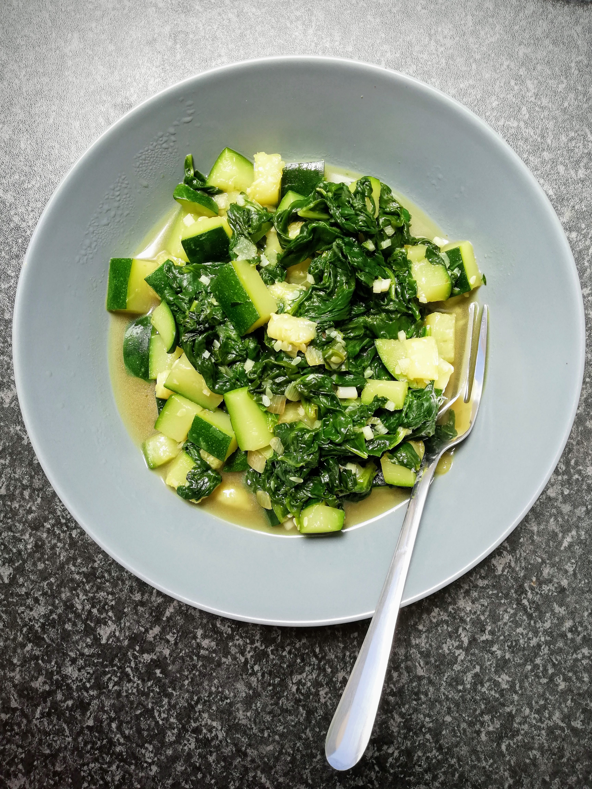
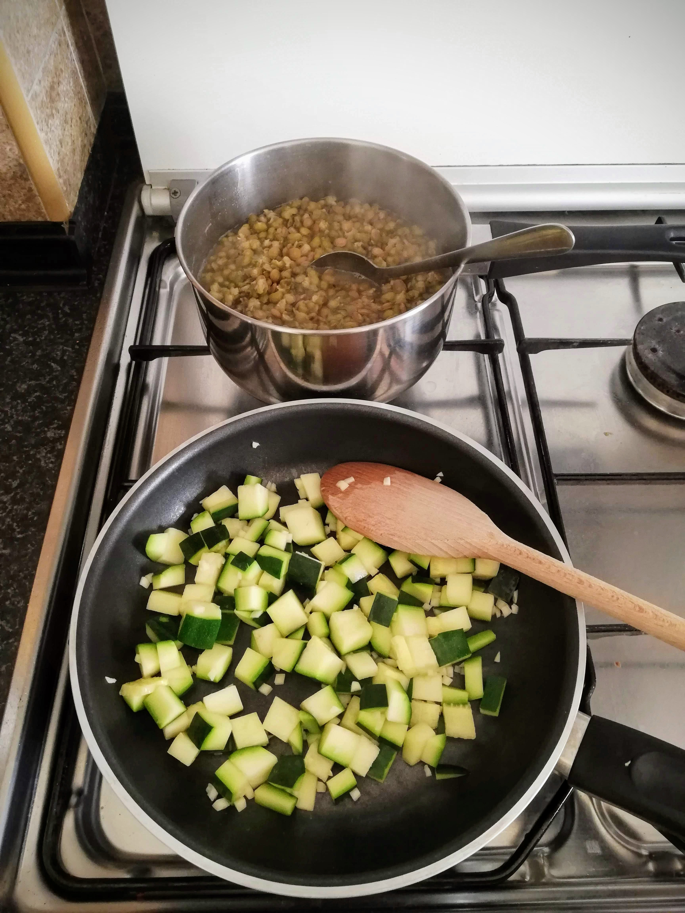

## Green Diet - What is that?

There really is an endless amount and range of diets and it feels like there is always a new one popping up somewhere. With this green diet from Kundalini Yoga I have discovered a completely new diet for me, which I find very appealing. This diet uses the **effect of the green substance chlorophyll**, which can be found in any green food. So during the green diet you eat mainly green fruits and vegetables and drink a lot of water or tea. This type of diet is **vegan** and is not limited in the amount of food you eat. 

Green furthermore symbolises growth, fertility and renewal. Many of you are certainly aware that green is also the colour for calmness and harmony. The associations with the colour green are usually **positive**. Green fruits, vegetables and other green foods are also **beneficial to your body**.  

### Effects

The green diet is alkaline and thus **balances your acid-base balance** with a focus on the alkaline. In doing so, you deacidify your body and start a **detoxification process** in your liver, which eventually rebuilds your whole system. In addition, your skin is cleaned and toxic mucus is removed from your liver. Weight loss can also be a side effect, but this is not the main focus. This and even more happens mainly due to the ingredient 
✨CHLOROPHYLL.✨

Green food contains chlorophyll to varying degrees. This can have a health-promoting effect on your body due to the amount absorbed. This **strengthens your immune system and your defences**. Chlorophyll is also an **antioxidant** and protects your body from free radicals. Your **magnesium and iron balance** is improved and your blood cells are purified and **new blood cells** are formed. Chlorophyll is also known as a **natural anti-aging agent**.

All in all, your whole body experiences an activation on a physical and mental level and can only benefit from it. 

### What to eat?

The possibilities here are definitely sufficient and it is also an interesting focus to concentrate only on green food. It is a pleasure to walk through the supermarket with this attention and be surprised by the **green variety**. 
I'll list some food groups with examples here, which should be readily available as a rule:

- any green salads and leafy vegetables (e.g. rocket, lamb's lettuce, chicory, spinach, chard, pakchoi) 🥬
- sprouts and germs (e.g. mung beans, green lentils)
- green vegetables (e.g. asparagus, okras, zucchini, broccoli, peas, green beans, spring onions, green peppers, leek, fennel and many more) 🥦
- green fruits (e.g. limes, from the inside green melons, pears, apples, kiwis, grapes, cucumber, olives, avocado) 🥑
- Oils (e.g. olive oil, pumpkin seed oil, ghee) 
- Herbs (e.g. nettle, wild garlic, dandelion, peppermint, lemon balm, parsley, coriander and many more) 🌿
- spices (e.g. green pepper, wasabi, dried green spices) 

🚫 Important: **No** salt! 
- Superfoods like wheatgrass, nettle powder, spirulina, chlorella and hemp protein

### And what about drinking?

**Water and herbal teas** (also green tea) are the most important things. But also **green juices** and the well-known **green smoothies** are allowed and a satisfying snack between meals. These are best prepared fresh. In fact, you can also drink the cooked or steamed water from your vegetables. Nothing has to be poured away. 😉 However, there are also drinks that you should **not** consume: coffee, alcohol and black tea. It makes sense to wean yourself off these drinks before you start your green diet, if you drink them at all. 

Well, so much for the theory of this detoxifying, purifying diet form. I have decided to do the green diet for **7 days**. Together with a friend of mine I plan to eat only green for the next 7 days. Exciting! 

I will share this process and several of my meals on my blog with you in the coming days. Be curious and let yourself be inspired. 

And this is what my first day looked like... 

## Day 1

 

I usually eat a lot of fresh fruit in the morning, but I still mix it with yoghurt or porridge. My first breakfast now allows me a **pure green fruit bowl** as you can see in the top of this post. These fruits did not really keep me full for a long time, so that I soon start to think about lunch. I bought some **spinach**, because I was very much in the mood for it. I add **zucchini** and a mini onion as well as some garlic (yes, these ingredients are allowed despite the missing green colour - what a blessing! 🙏🏽 ). Everything was cooked together and what can I say, it is really delicious. However, when I bought spinach I forgot how tiny the whole leaves still get. So the lunch portion was quite small for the size of my hunger.

Well then, since there is no limit to the number of meals - luckily 😀 -, I started cooking again in the afternoon. I had previously soaked the **mung beans** for a few hours and then boiled them up. I also add a good amount of **green lentils**. I think lentils are just delicious and suitable for mung beans - from my point of view only recommendable. You can also add the lentils to the mung beans for the last 15 minutes if you want to eat them together anyway. Just make sure that you have enough water in your pot - mung beans and lentils like to have enough water to get ready. Additionally, I add **zucchini fried with some onion and garlic**. That is also a very tasty menu.

In the evening I do some **Kundalini Yoga**, which is very good for me at this moment. I can immerse myself in the Kriya and relax. My body feels fulfilled and comfortable afterwards and I am deeply grateful. 

But… maybe you can guess… I was hungry again that evening. Oh gosh, should I cook again? A view into the pantry makes my eyes stop at the **Pimientos de Padron**. So I fry some of them thoroughly. This is really tasty. I also eat a few **green olives**. Finally I feel filled up again. 

Later in the evening I go to bed with a little hunger, but also with a **light and happy** feeling. The food during the day did me very well, I already noticed that this evening.
😇

Feel invited to read about the following days of my green diet project within the next days on this blog. 
