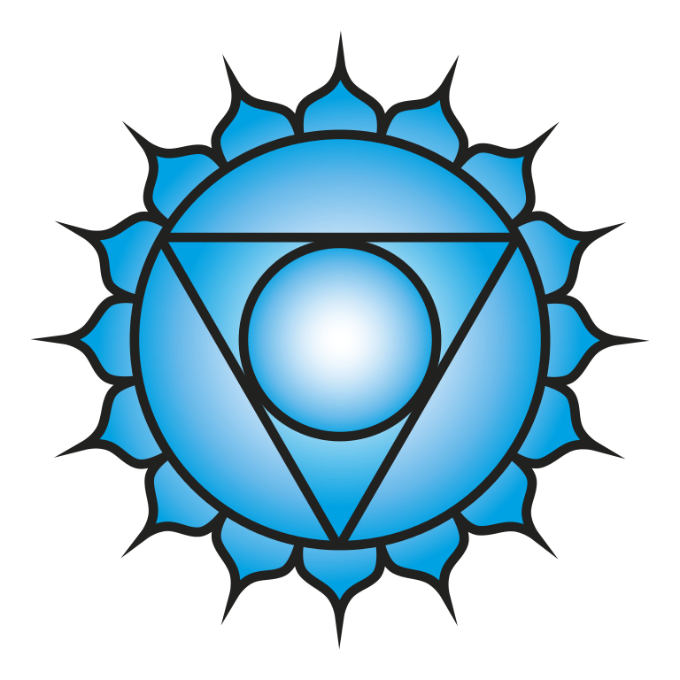

With the fifth chakra, after the lower triangle, the second triangle begins, which can be found among the chakras: the **upper triangle**. This fifth chakra, known as the throat chakra, is called **"Vissudha"** in Sanskrit. Translated this means **purity**. The upper and lower triangle are connected by Anahata, the heart chakra. 

The throat chakra, as the name suggests, is located in the **throat centre**. On an organic level, the **thyroid and parathyroid glands, trachea, throat and neck vertebrae** are connected to this chakra. 
The colour for this chakra is **light blue**. On a sensual level this is the level of **hearing**. 👂🏽

The central theme of the throat chakra is the **projected power of the word**, which means hearing and speaking the truth. It is also about the **expression of the soul** and expressiveness in general, but also about **authenticity, truth and higher self**. 

Here, experiences of your self-expression are processed, whereby it is mainly about the **highest expression of your soul**. A connection with the higher mind can be established if your throat chakra is permeable. Herein lies the source of **understanding** and the ability to **communicate**. Your very own search for truth lies hidden in this chakra and can be carried outwards through your communication as well as through contacts and wishes. 
With the help of this specific energy from the throat chakra you can achieve **self-determination, freedom** and **independence**. You can re-evaluate any beliefs you have learned through your own truth filter and thus live out these values. Consequently, there is room for the **expression of your soul's individuality** - through **communication** or **creative self-expression** like for example dance or art. 💃🏽

The **connection with your higher self** is made possible through the throat chakra. Through this, soul messages as well as your own destiny can be felt free of any conditions. The identification with your own ego can be transcended through this chakra so that you can **live your true self**. An **opening to the higher levels of the subtle dimension** is also made possible. Now the greater connection behind all things can be recognized.

### Just say it!

Let's dive deeper into the realm of **communication**, of language. Everything starts with your **spoken word** (Vaak Siddhi), which is the highest of all seeds (Bija). This is the power that initiates manifestations of physical forms or actions solely through the utterance of the words. These are then the **seeds for the emerging manifestations**. Transmitted this means that the power of man is so strong when it comes to determining the direction of an action. The seeds are planted and from that moment on they are handed over to the laws of Maya. From then on it is difficult to change the course of events, because **things have already been set in motion**, the seed has already spread its roots and **growth** is taking place. 🌱

The **spoken word** stands for **power to plant the seeds**, which in turn can fulfill the highest **destiny** of someone. So if the word is mastered and with it the ability to initiate the actions that come out of the soul, then the gate to the higher regions of this upper triangle can be opened. This is why the throat chakra is also called an **enormous gate**. 
The power of **projection** is also not to be despised here.
Communication in general is rather blunt, according to the motto "So be it". 

### When the throat chakra is open ...

... then you experience the perception of the **subtle** and are able to **express yourself and your own truth**. You can express sensations, feelings and attitudes freely and openly and have a preference for communication itself. This also means that disputes are not problems in themselves, as they are usually considered to broaden horizons. **Speaking clearly** and getting things to the point is generally not difficult. But it is also **easy to listen**, and this also means being able to **understand other people - as well as yourself - from a higher perspective**. At the same time, the own weaknesses are also accepted.
People with an open throat chakra can **improvise** well. Furthermore, openness towards different kinds of **inspiration** prevails. 
The own wishes and the ability to manifest and fulfil them in the own life are perceived.
Basically, the **expression of the own intuition or soul is undisturbed**. You can let yourself be led trustingly by your **inner guidance**, your intuition. With this you are **authentic** to yourself as well as to others and are in a more integral connection to your soul. It comes to an **end of the identification with the ego**, which enables the opening for the pure expression of the soul. 

### Out of balance

If, on the other hand, the throat chakra is disturbed, this can be due to **painful experiences** and a **lack of self-expression** as the being you are. Especially difficult life situations at the **age of 16 to 21 years** can have a negative effect on the development of the throat chakra and inhibit developments. The consequences are, for example, a **disturbed self-expression** and a **disturbed communication with the environment**. In addition, **needs, wishes etc. cannot be communicated** and others cannot be listened to. The **inner fear of contact with others** can then lead to **inhibitions**, which can also be explained by fear of rejection, criticism, loss of control and negative reactions in general. These fears, in turn, can lead to constructs of **lies, exaggerations** and even **bizarre self-dramatization**. In addition to uptightness, apathy can also occur in some cases. This whole behaviour serves as a **protection**, because nobody else is shown with the true self. To the outside world these people do not show themselves clearly. 

Furthermore, there is often **no access to the inner self** and **no trust in the own intuition**. The self-confidence is low or even non-existent. In extreme cases, speech disorders occur. 
The world is also often perceived as **colourless** and poor, as the ability to dream, try out and improvise is rather poor. 
All this leaves **pain** for the own soul and can lead to **remorse, self-condemnation** and an **excessive hardness** towards oneself. 
On the physical level, possible symptoms include recurring inflammation of the throat and mouth or hyper- or hypothyroidism. 

### Element Ether

The throat chakra is dominated by the **etheric element**, which provides insights into the wondrous and mystical. Ether is considered the **most subtle of all elements** (besides earth, water, fire and air). Ether is regarded to be a **state of time and space** that allows a thing to exist. Thus this element is the very beginning of the **manifestation process**.

#### Main features of the heart chakra

- Sanskrit: Vissudha
- Position: Throat, neck
- Color: light blue
- Element: Ether
- Psychological function: Self-expression
- Challenge: Lying
- Creative identity
- "I talk." / "I have the right to speak and be heard."

### Kundalini Yoga & Vissudha

To activate this chakra or to bring it back into balance, the following yoga exercises from **Kundalini Yoga** can help you. 🧘🏽‍♂️

- Any chanting
- Shoulder stand
- Cobra
- Plow pose
- Camel position
- Cat - Cow
- Neck rolls
- Neck Lock
- Nose to the knees

As usual, these exercises are not a panacea and you have to **look for yourself individually, what exactly you can do in which way**. If you are uncertain, please always consult your doctor. 

During a **Kundalini Yoga session** usually different chakras are touched and activated, often with a focus. If you would like to know more about this or if you would like to book a Kundalini Yoga session with me on a specific chakra or topic, please **feel free to send me an email** as usual. ✉️

In my next blog post I will focus on the **sixth chakra**. To keep up to date with my current posts, I invite you to follow me on my social media channels ([facebook](https://www.facebook.com/ruhahealing), [twitter](https://twitter.com/ruhahealing), [instagram](https://www.instagram.com/ruhahealing)). 🙏🏽
