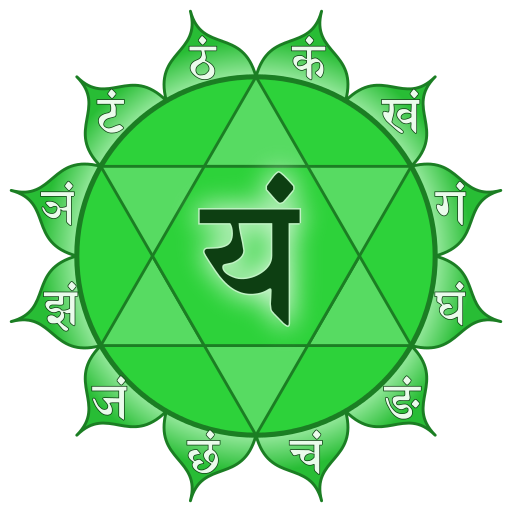

Having already got to know the first three chakras as the lower triangle, you will get some insights into the fourth chakra, the heart chakra, today. In Sanskrit it is called **Anahata** and can be translated as **"not beaten sound"**. It is a sound that is not produced externally, i.e. without the clash of two things. This alone brings a certain fascination and enables us to look beyond the horizon. 

The heart chakra, as the name suggests, is located in the **heart space in the middle of the chest on the sternum**. The **heart** and the **lungs** are assigned to this chakra as organs, as well as the **thymus gland**. 
As far as the colors are concerned, we are now in the space of **pink** and **green**, where pink means the heart itself and green emphasizes more the protection of the heart. As a rule, however, only the color green is referred to. 💚

The heart chakra is located **exactly in the middle of the first seven chakras** and **connects the lower triangle** (first 3 chakras) **to the upper triangle** ( 5th to 7th chakra). Thus it connects the **worldly dimension** (lower triangle), our **humanity**, with the **spiritual level** (upper triangle), our **soul**. It provides a balance between the lower energy flow of the earth and the flow of the upper energies of heaven and prepares the way **from the I to the WE**.
The heart chakra, as the first chakra, becomes completely subtle. 
The main focus within this chakra is on **love, awakening, trust, devotion, pain and forgiveness**. 🙏🏽

The Anahata has enormous power and significance. It processes the experiences of love as well as the subtle feelings and sensations associated with love. The energy of the heart chakra develops your capacity for **unconditional love and devotion**. In the heart dwells the **pure, universal love of your soul**. This brings with it the ability to accept all people and events with a **non-judgmental** acceptance, i.e. with **neutrality**. Through the love that then permeates you, you can feel and learn your own inner truth without condemnation. A space is opened to you in which you can feel everything. No pain or darkness can damage this strong unconditional love. 

Here the complex world of human love opens up and relationships of real love become possible. This is where you are prepared for deeper love, the **spiritual love of the soul** and **cosmic love**. The search for love in the outside then ideally leads to **finding love within yourself as a source**. By embodying love, because it is within you, you also give it to the outside, so that your **light of love** can be reflected and fulfilled in the world. With this experience you can let yourself fall even more into yourself, open yourself to the inside, because you do not (any longer) need the outside for feeling love. You can always get in contact with love, because it always flows. 
This love finally also enables you to **forgive from the heart**. ❤️

Another characteristic is the **sensitivity** that this chakra brings with it. Here you are touchable up to your soul and you can also feel other people with their true self. In addition, a **universal consciousness of connectedness** can arise in you, which goes beyond the realm of your personality. 
Your heart centre determines the subtle feeling and the ability to touch. When a person speaks from his/her heart, this touches us, as it penetrates to our innermost being. 

Central is also the topic of **healing** and **spiritual growth**. Through the contact to your own soul you come closer to yourself and can stimulate a healing process. Personality and ego are then transcended. 

In Kundalini Yoga by Yogi Bhajan the mind is divided into three different minds: negative, positive and neutral. What exactly this means, I will explain to you in a separate blog post. The heart chakra definitely also refers to the area of the **neutral mind**, as this is necessary to give other people the same **value** we would attribute to ourselves. 
Here in the fourth chakra there is a **conflict-free state** in which heaven and earth come together in balance. Inside and outside merge in a perception of **flowing**.

The already mentioned lower three chakras embody, among other things, the cultivation as well as mastery of the impulse, whereby the feeling of the **ego** is present. When your heart chakra opens, you reach the first **true level of self-reflective consciousness**. You can see yourself through the eyes of others and realize that other beings are as important as yourself. Thus the feeling of **I** shifts more to a feeling of **WE**. An important basis for this is a **powerful, stable self** (through a strong lower triangle) to open your heart chakra. If your lower triangle is still too weak or even disturbed, then the love of your heart can be pulled again and again into the dynamic of the needs of the lower three chakras and in the end be distorted. 

When your heart chakra is open there is a **connection between your heart and your mind in the light of your soul**. Your soul can then express itself in your personality. This is also called the **gateway to other dimensions of being**. People with an open heart chakra have recognized the source of love and love themselves **unconditionally**. In life they let themselves be guided by their sensations of the heart, which is also called **heart intelligence**. 
There is a **devotional and expectation-free love** as well as **acceptance** towards all living beings present, because a **feeling for the soul** is felt deep inside the others. Through this **universal love** from within, there is a radiance to the outside, which is also perceptible for the environment. 💓

True **joy** of the heart and much **laughter** are present, as well as **warmth, love, compassion, sensitivity, gentleness** and **patience** are felt within oneself. A deep feeling of **gratitude** and **connectedness** with all that is is created.
The relationship to the own feelings is renewed and they can be consciously recognized and controlled. Furthermore, people with an open Anahata give themselves as well as all others the **freedom to grow independently** and to accept any path in life. 

In addition, the heart chakra can also be described as another **immune system** that knows when something is a foreign or belonging part. This means that you know how to include people appropriately in each of your relationships. 

Let's also look at the area of **communication**: communication from the heart center includes others as well as yourself. You speak with **empathy** and **kindness** to yourself and others. You are aware of the person to whom your communication is directed. Thus a feeling of **presence** can be perceived by all participants. The language here is **true**, but always **friendly**. 

### Can the heart chakra also be disturbed?

Your heart chakra can also show blockages or disorders that can have various causes. In general the **experience and feeling of being separated from love** can lead to a traumatic experience. **Strong emotional pain** can then trigger blockages in the Anahata. This in turn can lead to **distrust** and a **refusal** or even **inability to love or be loved**. Blockages can also be caused by feelings of resentment or revenge, which in turn have their own individual history. The connection to the own heart can also be interrupted if a person has done something to others, which can lead to a strain on the soul and finally to **self rejection or condemnation**. 💔

Generally speaking, one of the two poles of relationship is usually **overemphasized**: a narcissistic self-centredness and refusal to face the world or a self-sacrificing dependence on the love of others, even to the point of self-abandonment or even self-hate. Thus, overactivity of the heart chakra may lead to an **excess of compassion**. An undersupply, in turn, can end in **dependence** and a disturbed feeling for the own self. 

### The element air 

The element assigned to the Anahata is **air**. It is symbolized by the **breath**, which creates a **connecting flow between you and creation** - by the fact that the air surrounding you enters you and exits again as the breath of life, touching the world. Allow what is also hidden behind your breath to work on you...

### Can I touch that?

Here you can also find one of our senses, which is assigned to this chakra: the **sense of touch**. This means above all to **feel, perceive, touch and be touched** on various levels. 
Also the connection to the **hands** stands for the ability to touch and feel.

#### Main features of the heart chakra

- Sanskrit: Anahata
- Position: Heart centre, in the middle of the chest on the sternum
- Color: gGreen (and Pink)
- Element: Air
- Psychological function: self-acceptance
- Challenge: Grief
- Social identity
- "I love." / "I have the right to love and be loved."

### Kundalini Yoga & Anahata

What would we do without Kundalini Yoga, that's what I sometimes think. It is such a powerful resource for us human beings here on earth that I am enthusiastic about this style of yoga and its possibilities every time. You can also find specific exercises that work on your heart chakra and can release blockages and connect to other chakras. 

- Ego Eradicator
- Yoga Mudra
- Bear grip
- Baby Pose
- All arm exercises
- Exercises that rotate the upper part of the upper body
- All Pranayama exercises

Furthermore, the **sound** is also explicitly mentioned here. The sound **"Ham"** can open your heart chakra and activate the relationship with the fifth chakra. The Anahata is stimulated by Prana, so that the use of **Pranayama** (breathing techniques) stimulates your heart space in a powerful way.

Again, please look for yourself to see what works and what does not, where your **individual possibilities and limits** lie! This small list can serve as an aid, which you are welcome to try out if you feel like working on your fourth chakra.

Within a **Kundalini Yoga session** usually different chakras are touched and activated, often with a focus. If you would like to know more about this or if you would like to book a Kundalini Yoga session with me on a specific chakra or topic, please **feel free to send me an email** as always. ✉️

In my next blog post I will focus on the **fifth chakra**. To keep up to date with my current posts, I invite you to follow me on my social media channels ([facebook](https://www.facebook.com/ruhahealing), [twitter](https://twitter.com/ruhahealing), [instagram](https://www.instagram.com/ruhahealing)). 🙏🏽
