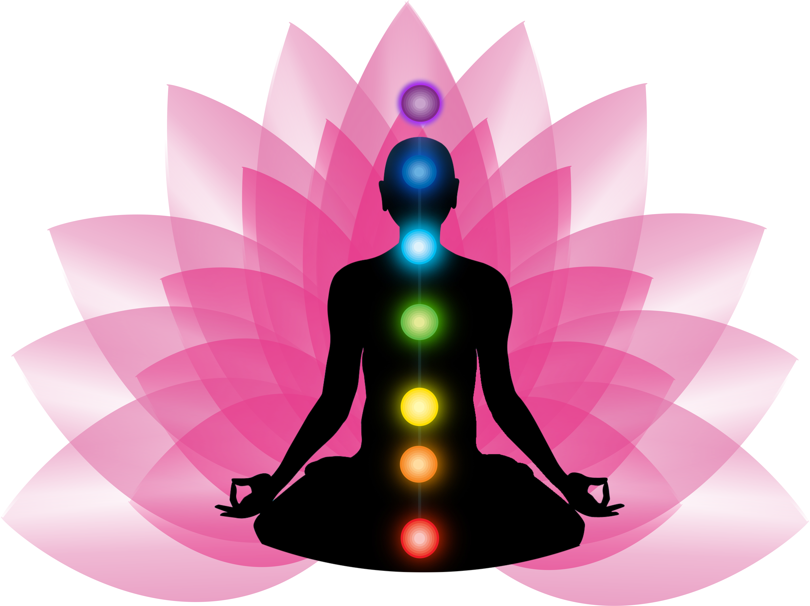
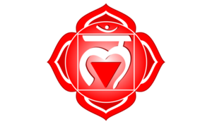

Perhaps you have already heard that the human body is equipped with different chakras. In Kundalini Yoga we always refer to the chakras and their **particular energies**, which can be stimulated by the postures. But let me start from the beginning. 

### What exactly is a chakra?

The word "chakra" comes from **Sanskrit** and means **wheel** or **circle**. It refers to energy wheels or centres in the body that are in a constant circular motion. According to this, a certain energy and power emanates from them. This energy flow refers to an interplay between physical and subtle space. These energy wheels are **always in motion and change**, just as the energy itself constantly changes its frequency of oscillation. 

In the context of **Kundalini Yoga** the focus is on **8 chakras**. Seven of these chakras are related to the endocrine system or nerve plexuses, the eighth is associated with the magnetic field of the body.

The chakras are activated by **Prana**, the power of life, and dissolve blockages that stand in the way of a **free flow of energy**, or first (re-) establish a connection. The goal is always that everything is in the flow, that the energy centres can let their energies flow out. Through Kundalini Yoga this flow and the necessary **balance** and **purification** of the chakras can be made possible. If there are blockages in the chakras, these can be released by practicing yoga. 🧘🏽‍♂️

It is also interesting to note that the chakras **influence perception** as well as **decisions** and **feelings**, as they can be related to different parts of the body. Furthermore, they influence your own **projection** into the world. This again increases the power that emanates from them. Thus the flow of thoughts and energies in your system is also controlled by them. The human being therefore always acts and projects from the energies of the chakras. 

### A closer inspection of the first chakra

The chakra mentioned as the first in the series is the **root chakra**. In Sanskrit it is called **Muladhara**, where mula means "root" and adhara means "base". The root chakra is located at the **end of the spine** between the anus and the sexual organ. The first chakra is associated with the **colour red** - see the red dot at the bottom of the figure above. It belongs together with the second and third chakra to the lower triangle. 
It is also referred to as the **foundation** and serves for **survival**, gives **security** and stands for **habits** as well as **self-acceptance**. ❤️

More precisely, this means that the first chakra reduces everything to the **basics** and takes care of the basic needs. There is a connection to the **element earth** and therefore it is responsible for all **manifestations in the physical nature**.
The root chakra also serves to **automate behaviour**. Consequently, this is also the place for habits and contains the strength to develop regulated habits. 

The root chakra is assigned to the area of **excretion**, the **anus** and the **large intestine**. Excretion here means everything from physical to emotional and mental. 
In order to **survive**, the human being needs a **functioning ability to excrete**, which is provided by the energy of this chakra. So there is a considerable protective factor connected with the first chakra. With this knowledge you can make yourself aware that you have the ability to release negative influences (people, thoughts, environments and more) with the help of the power of the first chakra.

It is quite exciting to realize the fact that the own **emotions** are connected to the energies in the chakras and are influenced by them. Depending on the intensity of the connection to the chakra, the different forms of emotions can be felt within yourself. 

If the root chakra works well, you are connected to it and it is in harmony with the other chakras, then it gives **purity, security, perseverance, versatility and other abilities such as steadfastness, loyalty, calmness, patience and a positive kind of intransigence**. In addition, there is a feeling of **self-sufficiency** which arises from a **restrained negative mind**. No dangers are seen and the feeling of having a foundation and of experiencing and giving support is present. Based on this, changes are implemented step by step and a **basic level of trust** is a matter of course. Thus, the first chakra is also a basis for **allowing the self-confidence to take root and grow**. 🌱

At the same time it can also lead to an **over- or dysfunction** of the muladhara, which can result in various **diseases**. It is about **letting go** on the one hand and **holding** on the other. Not being able to let go of anything can mean, for example, that toxins multiply in your body and you poison yourself. Similarly, too much clinging to things such as habits and the resulting lack of new impulses can cause you to become emotionally undersupplied. This is based on a feeling of **fear**, for example of separation or poverty. More precisely, this means that there is a detachment from the inner grounding energy, i.e. a missing connection to the own root chakra. 
A balance or reconnection is accordingly important.

Another connection exists with the **sense of smell**. If you tend to hold on to and retain the toxins, you start to stink. Consequently, distance is experienced starting from other people. If the first chakra is in harmony, then you are more likely to spray a sweet body odor. What is certainly known to many is the statement that you have to be able to "smell each other". The sense of smell also helps you to **recognize or establish a similarity and connection to your counterpart** through smell. 

#### Main characteristics of the root chakra

- Sanskrit: Muladhara
- Position: at the end of the spine between anus and genitals
- colour: red
- Element: Earth
- Psychological function: Self-protection, Survival
- Challenge: Fear
- Physical identity
- "I am." / "I have the right to exist."

### Kundalini Yoga & Muladhara

Through the practice of Kundalini Yoga every energy of the chakras can be **transformed** and **consciousness** can be raised. You can use the techniques of Kundalini Yoga to use the system of the chakras for yourself. 
Through the practice of Kundalini Yoga you can build a **strong(er) connection** with this energy center - and all the other chakras as well. This can help you to arrive completely in your body and on earth, to live and to be in physical and emotional balance. 

Many of the techniques **strengthen the central functions of the root chakra and integrate their energy into the higher chakras**. In addition, imbalances within the chakras can be balanced and you can get back into your center. Often it is also said that there are blockades in one or more chakras, which you can dissolve with the help of different positions as well as Kriyas or meditations from Kundalini Yoga. In other words, you may also have a missing connection to your chakra, which you can find and restore through Kundalini Yoga. This is primarily about the **connection to Mother Earth**, to the **basis of everything**. 🌍

Here you will find a list of **positions that can harmonize and strengthen the first chakra**:

- Crow position
- Chair position
- Body drops
- Frog
- Mulbandh
- Forward bending
- Kick your bottom with your feet lying on your stomach
- Sat Kriya

However, in general I would like to point out again that this list is not a "universal remedy" and **everyone has to look for him or herself what works and what doesn't, where the individual possibilities and limits are!** It can serve as an aid that you are welcome to try if you feel like working on your first chakra. 

Within a Kundalini Yoga session, different chakras are usually touched and activated, whereby often a main focus can be identified. If you would like to know more about this or if you would like to book a Kundalini Yoga session with me on a specific chakra or topic, you are welcome to **send me an email**. ✉️

In my next blog post I will explain more about the **second chakra** - to stay up to date about my current posts and more, I invite you to follow me on my social media channels ([facebook](https://www.facebook.com/ruhahealing), [twitter](https://twitter.com/ruhahealing), [instagram](https://www.instagram.com/ruhahealing)). 🙏🏽

