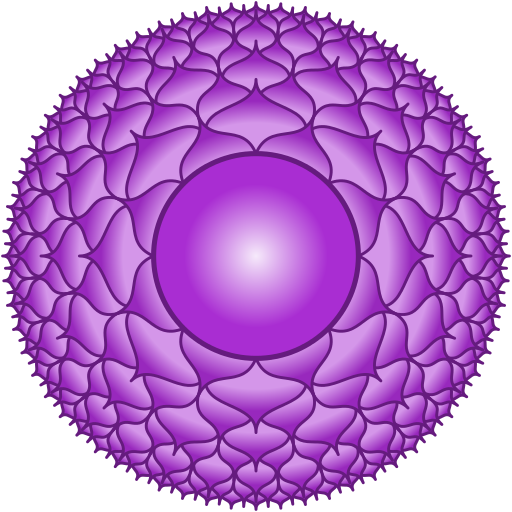

The journey through the eight chakras in Kundalini Yoga continues. Today the focus lies on the **crown chakra** as a very important central chakra. It is located at the **vertex of the head** and also above it and therefore slightly outside the body. 
In Sanskrit this chakra is called **"Sahasrara"**, which can be translated as "thousand times".

Organically, the crown chakra is associated with the **brain** and especially the **pineal gland**. The chakra is represented with the color **violet**. As an element in a broader sense, the **cosmos** is associated here. 
Thematically, the seventh chakra covers the areas of **consciousness, fulfillment, spirituality and divine guidance**.  Through this chakra, a connection is created between humanity and divinity, to the greater whole, the **cosmic consciousness**. Through this it is possible for us to gain **access to the highest form of wisdom and knowledge** - through the process of fusion and unity. It is about understanding beyond the possibilities and limitations of the mind. 
Important is also the **activity and opening of the already known six other chakras**. The crown chakra cannot be consciously controlled in this sense - in contrast to the other six "underlying" chakras. 
In addition, the **kundalini energy**, which has already risen through the other chakras, comes together here. After this ascent, the kundalini energy moves back down to the root chakra. 
Moreover, the **hormonal balance** and the balance in the entire body system are also regulated here. 

Another important aspect of the crown chakra is **humility** and **devotion**, which is shown by **bowing to infinity**. Here you can also find an explanation for bowing: The vertex and thus seat of the seventh chakra is brought down to the earth when bowing. This creates a **center of attention and direction of flow of the blood**. New feelings of openness and strength can be conveyed through it. 

In general, when strengthening the crown chakra, care must be taken to **avoid the development of a spiritual ego**. Here humility plays an important role in order not to gain the spiritual powers for the ego and for the sake of power. A connection to integrity and wholeness is accordingly important. 

### When your crown chakra is open ... 

... you experience the **holistic transcendence of your identity as a separate person**. This step of development is often called **enlightenment**. You feel a feeling of **boundlessness**, without limitations. The world can be understood beyond your own mind. The intensive connection with the spiritual world enables a deep feeling of **inner peace, completely connected with divine love**. Thus, fears on the inside become a strange, unrelated feeling. 
The opening of the crown chakra also means an opening towards the **divine guidance** in your own life. Everything that exists is perceived in unity and connectedness. Other people are met with **compassion** and **tolerance**. There is no urge (anymore) to change the fellow human beings. Life contexts are understood deeper and deeper on the spiritual level.

### Can your Sahasrara also be blocked?

In this chakra there exists more of an **underdevelopment** than a mere blockage or disorder. This underdevelopment seems to be widespread. 
If a lot of anger accumulates in someone and this anger is projected in a diffuse way to a higher force, this can lead to a **total aversion and rejection of a connection to the Divine**. 
On a psychological level, being cut off can lead to **disorientation, spiritual emptiness** and finally **uprooting**. Then the feeling of leading a meaningless life and ignorance of the true self can be present. 

#### Main characteristics of the crown chakra

- Sanskrit: Sahasrara
- Position: at and above the vertex of the head
- Color: Purple
- Element: Cosmos
- Psychological function: Self-knowledge
- Challenge: Attachment
- Universal identity
- "I understand." / "I have the right to know."

### Kundalini Yoga & Sahasrara

The practice of specific exercises from **Kundalini Yoga** can help you to open your crown chakra. 

- Ego Eradicator
- Mahaband
- Sat Kriya
- Concentration on the tip of the nose
- All meditations 

As usual, this list of exercises is **not** a panacea. Please **always look for yourself individually, what exactly you can do in which way**! If you are uncertain, please always consult your doctor. 

Within a Kundalini Yoga session usually different chakras are touched and activated, often with a focus. If you would like to know more about this or if you would like to book a Kundalini Yoga session with me on a specific chakra or topic, please **feel free to send me an email**. ✉️

In my next blog post I will dedicate myself to the **eighth** and thus last chakra of this series. 

To keep up to date with my current posts, I invite you to follow me on my **social media channels** ([facebook](https://www.facebook.com/ruhahealing), [twitter](https://twitter.com/ruhahealing), [instagram](https://www.instagram.com/ruhahealing)). 🙏🏽