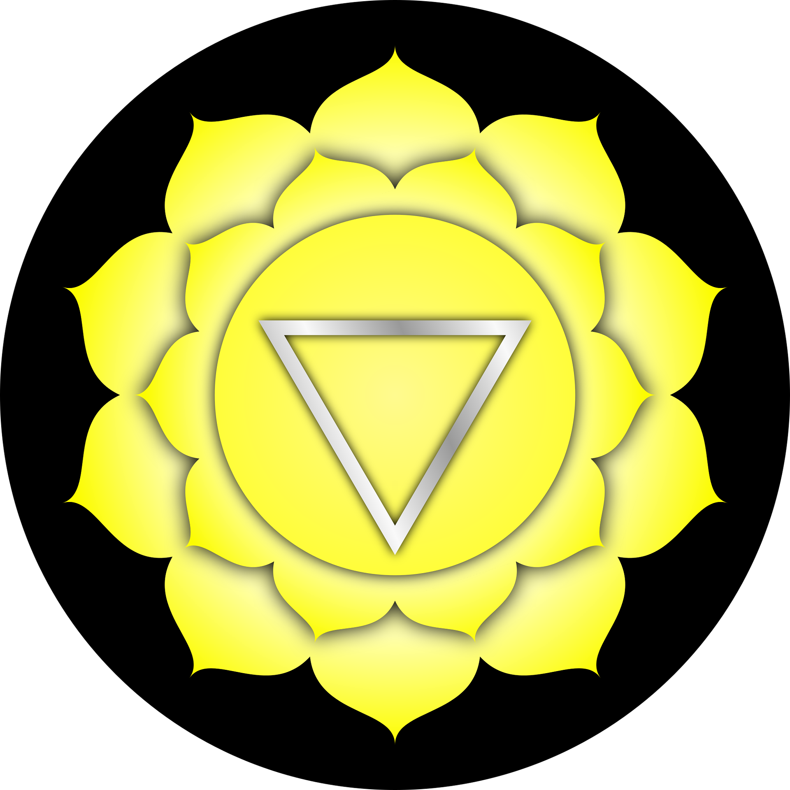

#### The journey of the chakras continues ... 

... with the third chakra, also known as the **solar plexus or navel chakra**. The Sanskrit name for this chakra is **Manipura**. Manipura translates as **"city of jewels."**

The third chakra can be located in the area of the **navel point to just above the solar plexus**, also known as the "sun network". On a physical level several organs are assigned to this chakra: **liver, gall bladder, spleen, digestive organs, pancreas, adrenal glands and solar plexus**. 
In terms of colour we are now in the colour **yellow**. Together with the first and second chakra, the **lower triangle** is completed by the navel chakra.
Central issues within this chakra are **action** as well as **balance, thought patterns and beliefs, personality, power, willpower and control**. 

More specifically, the third chakra is the **center of energy and willpower**, which comes together with a sense of **coordination and control**. The basic energetic balance is massively influenced by the third chakra. The mentioned topics are linked to the **self-conception** you have as a human being and your personal power and strength. This is your **driving force**, which ultimately brings you into action - also to realize your own ideas. 
Ideally, the topic of power expresses itself through **self-confidence, integrity and the ability to act**. 

A central concept here is also **personality**. Within this chakra your experiences and complex emotions are digested and translated into a mental structure. This is also where the relationship to the digestive organs becomes visible. Your own mental concepts emerge, which in turn are fundamental for the processing of conscious and unconscious experiences. A **mental structure of thoughts and beliefs** is formed, which then develops into the self-perception of your own personality. Thus, in addition to all life experiences, your own **identity** or a collection of different identities is formed. Through the solar plexus chakra you can get access to these identities - in the form of fears and deep-seated unconscious thought and behavior patterns. 
Furthermore, **your own personality is THE possibility to let the light of the soul radiate into the world**. ✨

The third chakra is also identified as the **gateway to the fourth chakra**, where the space of the unconscious is left. This **unconscious** is concentrated in the entire lower triangle. The heart centre in the fourth chakra marks the starting point for the **consciousness**. In the solar plexus chakra the **subconscious** as well as the **gut feeling** is processed.

### Navel center & it's power

Let's take a closer look at the **navel centre**, which can also be seen as a symbol for the **beginning**. The navel point is the first point through which a person is nourished, i.e. supplied with energy. After birth, this navel point, which still exists, serves to **absorb cosmic energy**.
It is also interesting to note the positive effect that the alternate movement of arms and legs has on our system, such as when we **go for a walk**. This is because **energy is accumulated at the navel point**, which is accordingly available to us. The third chakra therefore also houses the **energy reserve of the body**. 
In addition, from the navel point the **Kundalini energy** is set in motion and sent on its journey upwards. With this power we can penetrate into the **higher levels of consciousness**, which lie above the navel chakra. 
On this basis it also makes sense that it is important to stimulate, strengthen and finally distribute the energy at the navel point. This can be done, for example, through the Kundalini Yoga Asana **"Stretching Pose"**, which can be performed for a few minutes directly in the morning to stimulate the energy.
It is also related to the feeling for the presence of sufficient energy to support your own actions. This energy can then be projected with willpower to encourage action. 

This third chakra also represents the need and the drive to **realize your own ideas and wishes, to master challenges and to test yourself**. It gives you **strength for change, discipline and self-transformation** - besides the need for **control**.

When you have mastered the third chakra, you have gained the knowledge of how to initiate and end an action. You are able to recognize your own **mission** and create enough energy to act so that this mission can be accomplished. Furthermore, you are connected to your higher consciousness and use your **fearlessness** to act with **integrity**, regardless of the conditions.

With a well-functioning, open navel chakra, your own life as well as the quality of life is dependent on your own **actions**. Often you can find so-called "doers" or "action people" who are seldom calm, because they do a lot and are in action. Even weak intentions generate actions. The actions from this chakra are focused and characterized by **tactical intelligence**. Thus, **goals can be achieved despite possible obstacles** and emerging challenges do not become a barrier.
It is the ability to direct, shape and develop what happens in life, which ultimately leads to **deep trust** and a feeling of **security**. This can also explain why these people are often perceived by others as being at peace with themselves and having strong nerves. A dominance in the third chakra also ensures **exuberance** and **expression**. There is a relationship to your own feelings, which are also used to achieve your own goals. The own feelings can be reflected in an enriching way and stressful situations can be approached in a concentrated and peaceful way. 
In addition, the ideas about your own abilities are very **realistic** and also your own opinion is lived out in a healthy way. People take **responsibility** and cannot be manipulated. They have found their place in life and are about to **fulfil their mission**. They also possess a high degree of integrity and **decision-making ability** and can set themselves apart from the environment in a healthy way. Their own strengths and weaknesses are known by themselves. Their **self-esteem** is healthy and they have the ability for **self-reflection** and **discipline**. 
Basically you can meet here **adult, mature personalities** who have integrated their "inner child". 

### Not enough energy...

If there is too little energy in the navel chakra or if it is disturbed, this can have various effects on the individual life. 

This feeling of lack of energy leads to a recourse to **other energy sources** (for example through drugs or food), through which new energy can be accumulated. It should be obvious that this kind of energy supply is rather of an unhealthy nature. An urge to **compensate** is also being exerted through this.

Additionally, although there are good ideas and intentions, they are not put into practice. This is due to **the lack of energy, which prevents the action from taking place**. 
Also the emotional-mental processing of experiences can be blocked, which leads to an **overwhelming of experiences and feelings**. This in turn leads to a suppression of emotional expressions with the attempt of **control** and **rationalisation**. 
Often an undersupply or disturbance of this chakra also leads to being overwhelmed by the challenges of life, **desperation, anger, fear** and **weakness of will**. The world is then perceived much more through a **filter of powerlessness and worthlessness**. This results in a pronounced **emotional instability**. A movement between the extremes of **control mania** on the one hand and **letting oneself go** on the other can be experienced. In addition, these people may see themselves more as **victims** and feel neglected, in dependencies, envious and embittered. The self-image is shaped by negative convictions and eventually leads to a **loss of self-worth** and in extreme cases even to **self-hatred**.
This chakra can also become (over)active when another chakra is overloaded.

### The element fire 

This chakra is associated with the element **fire**. This symbolises the **willingness to set things in motion**. Very well known in Kundalini Yoga is the **breath of fire**, which supplies your third chakra with energy and also has a detoxifying function. 

### Can you see it?

The sense associated with the navel chakra is **seeing**. This power of seeing is linked to the **stimulation of the sympathetic nervous system**.
Vision is also about visualizing personal goals and creating concrete images. In this way a sense of **focus** and **will** can be created. It also stands for looking out into the world and then enables a comparison with the self-concept. Finally, vision then also creates a feeling of **control**.
What I consider particularly exciting here is **spiritual vision**. It enables you to **perceive the emotional-mental field that surrounds you** and to **feel the energies of the people around you** in an intuitive way. Fascinating! 🌟

#### Main characteristics of the navel chakra

- Sanskrit: Manipura
- Position: Are of the navel center, solar plexus
- Color: Yellow
- Element: Water
- Psychological function: Self-definition
- Challenge: Shame
- Ego Identity
- "I do." / "I have the right to act."

### Kundalini Yoga & Manipura

Manipura can also be activated, balanced and reconnected to the other equally important chakras through certain asanas from **Kundalini Yoga**. Here you find again a list of **exercises** that are especially interesting for the **Manipura**.

- Stretch Pose
- Sat Kriya
- Peacock position
- Archer Pose
- Fish Pose
- Uddiyana Bandh (Diaphragm lock)
- Breath of Fire
- all exercises that train the abdominal muscles

In general I would like to point out, as every time, that this list is **not** a "panacea" and you have to **look for yourself** what works and what doesn't, where your **individual possibilities and limits** lie! It can serve as a help, which you are welcome to try out if you feel like working on your third chakra.

Within a **Kundalini Yoga session** usually different chakras are touched and activated, often with a focus. If you would like to know more about this or if you would like to book a Kundalini Yoga session with me on a specific chakra or topic, please feel free to send me an **email** as usual. ✉️

In my next blog post I will focus on the **fourth chakra**. To keep up to date with my current posts, I invite you to follow me on my social media channels ([facebook](https://www.facebook.com/ruhahealing), [twitter](https://twitter.com/ruhahealing), [instagram](https://www.instagram.com/ruhahealing)). 🙏🏽

